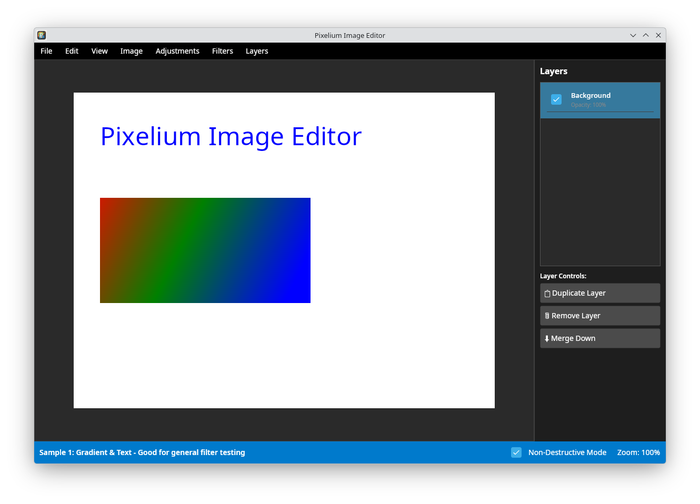
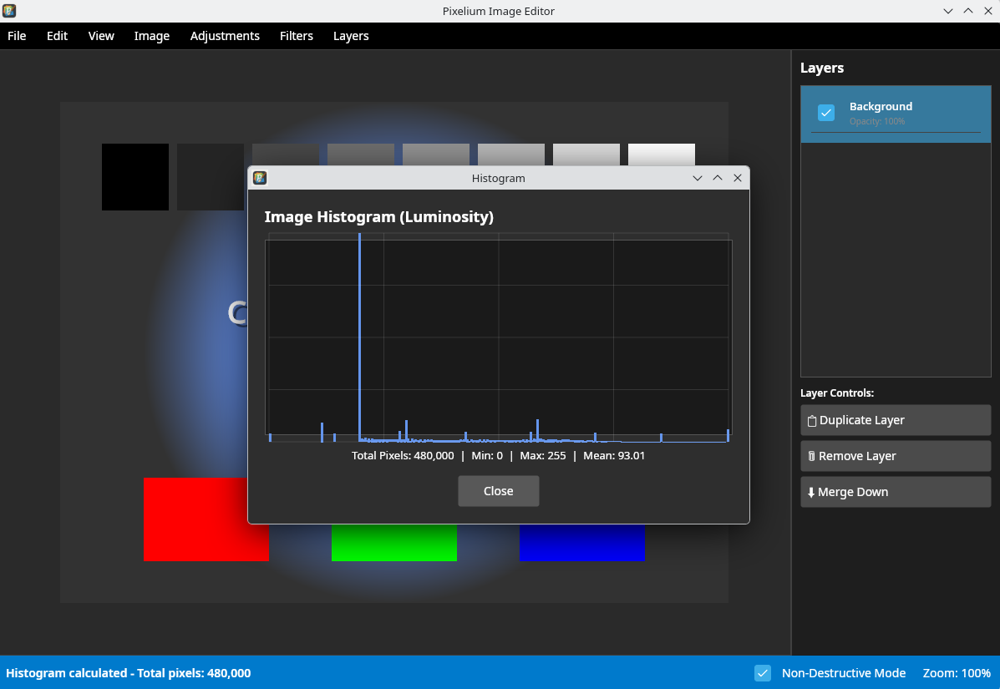
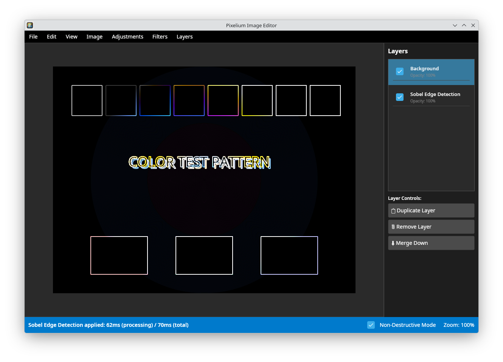
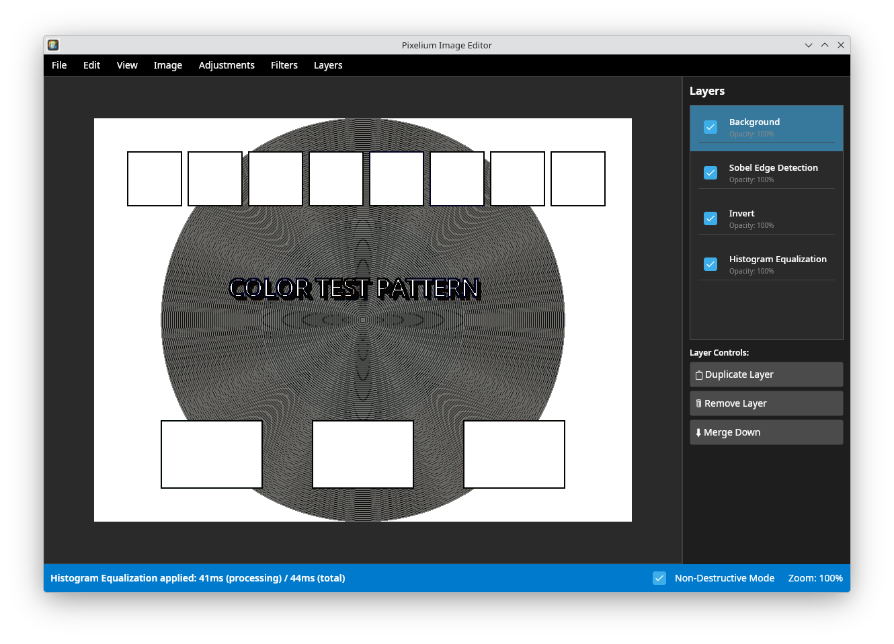
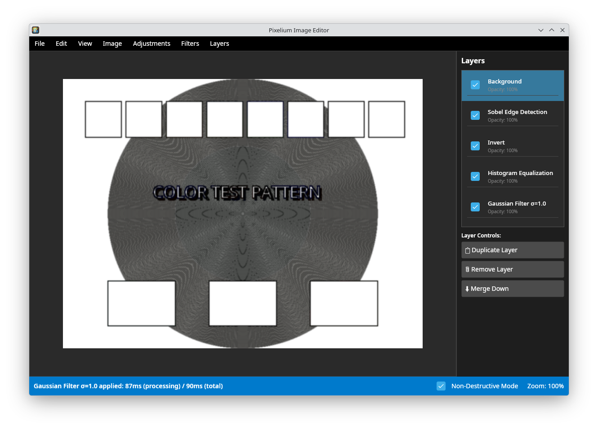

**Pixelium Képszerkesztő**

Dokumentáció


1970-01-01

# Bevezetés

## A Projekt Célja

A Pixelium egy nagy teljesítményű, többplatformos képszerkesztő
alkalmazás, amely a .NET 9.0 és Avalonia UI technológiákra épül. Célja,
hogy alapvető képszerkesztési funkciókat biztosítson gyors és modern
felületen, a párhuzamosság és gyorsítótárak kihasználásával.

## Főbb Jellemzők

- **Nagy teljesítmény**: Párhuzamos feldolgozés és memória-optimalizálás

- **Multiplatform**: Linux, Windows, macOS támogatás

- **Réteges szerkesztés**: Rétegkezelésen alapuló szerkesztés

- **Szűrők**: Gauss elmosás, élérzékelés, sarokdetektálás

- **Hisztogram analízis**: Hisztogram generálás a bemeneti képről

- **Visszavonás/ismétlés**: Undo/Redo művelet

# Telepítés és Futtatás

## Előfeltételek

A Pixelium Fedora 42 Linux rendszeren került fejlesztésre, szem előtt
tartva a keretrendszerek kiválasztásakor a multiplatform támogatást. A
program futtatható Linux, Windows és Mac rendszereken is.

## Fordítás a Forráskódból

A Pixelium fordításához a .NET 9.0 SDK-ra van szükség.

### Gyors fordítás

``` bash
dotnet build Pixelium.sln

dotnet run --project Pixelium.UI/Pixelium.UI.csproj
```

### Többplatformos fordítás

A `build-all.sh` szkript segítségével minden támogatott platformra
elkészíthetők a bináris fájlok:

``` bash
./build-all.sh
```

A fordítási eredmények a `builds/` könyvtárban találhatók gzip
állományba csomagolva.

## Támogatott Platformok

- **Linux**: x64, ARM64 architektúrák

- **Windows**: 10/11 (x64, ARM64), Önálló egyetlen EXE fájl vagy EXE és
  DLL-ek

- **macOS**: Intel és Apple Silicon processzorok, (x64, ARM64)

## Az Alkalmazás Indítása

### Forráskódból történő indítás

Az alkalmazás forráskódból a következő módon indítható el:

1.  Terminálablak megnyitása

2.  Navigáció a projekt könyvtárába

3.  Parancs futtatása: `dotnet run --project Pixelium.UI`

### Előre buildelt binárisok indítása

A kész, buildelt binárisok esetében az alkalmazás elindul a forráskód
vagy telepítés nélkül.

# Felhasználói Útmutató

## Kezdő lépések

### Alkalmazás indítása

A program indítása után egy beépített mintakép jelenik meg, ahol lehet
tesztelni a szűrőket. A későbbiekben másik beépített minta kép is
választható, vagy a tallózással megnyitható egy meglévő kép.

### Kép megnyitása

A kép megnyitásához több lehetőség is rendelkezésre áll:

- A **Fájl \> Megnyitás** menüpont kiválasztása

- A `Ctrl+O` billentyűkombináció használata

- A támogatott képformátumok közül választás (PNG, JPEG, BMP)

### Mintaképek betöltése

Az alkalmazás beépített mintaképeket tartalmaz, amelyek megkönnyítik a
különböző funkciók tesztelését:

- **Minta 1: Gradiens és szöveg** - Általános szűrőtesztelésre

- **Minta 2: Geometriai formák** - Él- és sarokdetektálás vizsgálatára

- **Minta 3: Színteszt mintázat** - Hisztogram és gamma korrekció
  tesztelésére

## A Felület Ismertetése

Az alkalmazás felülete több fő területre oszlik:

- **Menüsor**: Az alapvető műveletek és beállítások elérésére szolgál

- **Rétegek panel**: A rétegkezelés és tulajdonságok kezelésére szolgál

- **Munkaterület**: A képek szerkesztésének és megjelenítésének fő
  területe

## Képszerkesztés és Szűrők Alkalmazása

### Alapvető Szerkesztések

- **Szürkeárnyalatos** (`Ctrl+G`): A kép szürkeárnyalatosra konvertálása

- **Invertálás** (`Ctrl+I`): A kép színeinek invertálása

- **Tükrözés** (`Ctrl+H`): A kép vízszintes tükrözése

- **Gamma korrekció**: A kép fényerejének beállítása

- **Logaritmikus transzformáció**: Dinamikatartomány tömörítése

### Speciális Szűrők

#### Elmosási szűrők

Az elmosási szűrők a kép simítására szolgálnak:

- **Box Filter**: Gyors átlagolás alapú elmosás

- **Gaussian Blur**: Sima elmosás testreszabható kernel mérettel (3x3,
  5x5, 7x7)

#### Élérzékelés

Az élérzékelő szűrők a kép éleinek detektálására szolgálnak:

- **Sobel éldetektor**: Sobel operátor alapú élérzékelés

- **Laplace éldetektor**: Laplace kernel alapú élérzékelés

#### Harris Sarokérzékelés

A Harris sarokdetektálás használata a következő lépésekből áll:

1.  A **Szűrők \> Harris Sarokérzékelés** menüpont kiválasztása

2.  A paraméterek beállítása:

    - **Érzékenység (k)**: A sarokválasz szabályozása

    - **Küszöbérték**: A minimális sarokerősség (0-255 tartományban)

    - **Gauss szigma**: Az előfeldolgozó elmosás erőssége

3.  Az **Alkalmaz** gomb megnyomása a sarkok észleléséhez

## Hisztogram Analízis

### Hisztogram megjelenítése

A hisztogram megjelenítése a következőképpen történik:

- A **Hisztogram mutatása** menüpont kiválasztása

- A luminancia hisztogramjának megjelenítése

### Hisztogram kiegyenlítés

A hisztogram kiegyenlítés végrehajtása:

1.  A **Hisztogram kiegyenlítés** menüpont kiválasztása

2.  A művelet automatikusan javítja a kép kontrasztját

3.  Az eredmény ellenőrizhető a hisztogram ablak újbóli megnyitásával

## Rétegek Kezelése

### Rétegek létrehozása és kezelése

A rétegek kezelése a következő műveleteket tartalmazza:

- **Új réteg**: Filter alkalmazásával egy új réteg jön létre a rétegek
  panelen

- **Destruktív szerkesztési mód**: Filter alkalmazásakor nem jön létre
  új réteg, hanem a meglévőben megy végbe a szerkesztés

- **Rétegek egyesítése**: A réteg kijelölése után az "Egyesítés" gomb
  használata

- **Duplikálás**: A réteg kijelölése után a "Duplikálás" gomb használata

- **Elrejtés**: A rétegen a checkboxra kattintás

- **Törlés**: A réteg kijelölése után a "Törlés" gomb használata

### Réteg tulajdonságok

Az egyes rétegek tulajdonságainak kezelése:

- **Láthatóság**: A checkboxra kattintással kapcsolható a réteg mutatása
  vagy elrejtése

### Rétegek egyesítése

A rétegek kombinálásának lehetőségei:

- **Rétegek egyesítése**: A kijelölt rétegek kombinálása

- **Összevonás**: Minden látható réteg egyetlen rétegbe fűzése

## Visszavonás és Ismétlés (Undo/Redo) műveletek

A műveletek visszavonásának és ismétlésének lehetőségei:

- **Visszavonás**: `Ctrl+Z` (maximum 50 műveletig)

- **Ismétlés**: `Ctrl+Y`

- **Támogatott műveletek**: Minden szűrő és rétegművelet visszavonható

## Billentyűparancsok

| **Billentyűkombináció** | **Művelet**                |
|:------------------------|:---------------------------|
| `Ctrl+N`                | Új projekt létrehozása     |
| `Ctrl+O`                | Kép megnyitása             |
| `Ctrl+S`                | Kép mentése                |
| `Ctrl+Shift+S`          | Mentés másként             |
| `Ctrl+Z`                | Visszavonás                |
| `Ctrl+Y`                | Ismétlés                   |
| `Ctrl+G`                | Szürkeárnyalatos konverzió |
| `Ctrl+I`                | Színek invertálása         |
| `Ctrl+H`                | Vízszintes tükrözés        |
| `Ctrl+F`                | Illesztés a képernyőhöz    |
| `Ctrl++`                | Nagyítás                   |
| `Ctrl+-`                | Kicsinyítés                |
| `Ctrl+0`                | 100%-os nagyítás           |

Billentyűparancsok összefoglaló táblázata

## Képek Mentése

### Támogatott formátumok

Az alkalmazás a következő képformátumok mentését támogatja:

- **PNG** (Portable Network Graphics) - Veszteségmentes formátum

- **JPEG** (Joint Photographic Experts Group) - Tömörített formátum

### Mentési lehetőségek

A mentés kétféleképpen történhet:

- **Mentés** (`Ctrl+S`): Az aktuális fájl felülírása

- **Mentés másként** (`Ctrl+Shift+S`): Új fájl létrehozása

# Fejlesztői Dokumentáció

## Architektúra és Fő Komponensek

A Pixelium moduláris architektúrája két fő komponensből áll:

### Pixelium.Core

A képfeldolgozási könyvtár, amely független a felhasználói felülettől:

- Képfeldolgozási algoritmusok implementációja

- Rétegkezelés logikája

- Hisztogram számítások

### Pixelium.UI

Avalonia UI alapú asztali alkalmazás:

- Felhasználói felület komponensek

- MVVM minta implementációja

- Parancskezelés és visszavonás/ismétlés rendszer

## Kulcstechnológiák

Az alkalmazás a következő technológiákra épül:

- **.NET 9.0**: Modern, nagy teljesítményű alkalmazás keretrendszer

- **Avalonia UI**: Keretrendszertől független UI keretrendszer

- **SkiaSharp**: 2D grafikai könyvtár gyors rendereléshez

- **MVVM minta**: Tiszta választási rétegek megvalósítása

- **Parancs minta**: Visszavonás/ismétlés funkcionalitás implementációja

## Teljesítményoptimalizálások

A Pixelium több teljesítményoptimalizálási technikát alkalmaz a gyors
képfeldolgozás érdekében.

### Lookup Table (LUT) Gyorsítótárazás

A lookup table-ök (keresési táblázatok) előre kiszámított
transzformációs értékeket tárolnak, ami jelentősen felgyorsítja a
pixelenkénti műveleteket.

#### LUT szolgáltatás implementációja

A `LookupTableService` osztály a következő funkciókat biztosítja:

- **Thread-safe cache**: `ConcurrentDictionary<string, Lazy<byte[]>>`
  alapú gyorsítótár

- **Lazy inicializálás**: A LUT-ok csak az első használatkor kerülnek
  kiszámításra

- **Előre betöltött táblázatok**: A gyakran használt táblázatok (invert,
  grayscale, gamma) már inicializáláskor létrejönnek

- **256 elemű táblázatok**: Minden lehetséges bemeneti érték (0-255)
  számára előre kiszámított kimenet

#### LUT alapú szűrők

A következő szűrők használnak LUT-ot a gyors végrehajtáshoz:

- **GrayscaleProcessor**: Három külön LUT-ot használ (R×0.299, G×0.587,
  B×0.114)

- **InvertProcessor**: Egyszerű 255-érték LUT

- **GammaProcessor**: Gamma érték alapján előre kiszámított táblázat

- **LogarithmicProcessor**: Logaritmikus transzformáció LUT-ja

### Párhuzamos Feldolgozás (Multithreading)

A képfeldolgozó algoritmusok intenzíven használják a párhuzamos
feldolgozást:

#### Sor-alapú párhuzamosítás

A képfeldolgozás soronként történik párhuzamosan a `Parallel.For`
használatával:

``` [Sharp]C
Parallel.For(0, bitmap.Height, y =>
{
    byte* rowPtr = ptr + (y * bitmap.Width * 4);
    for (int x = 0; x < bitmap.Width * 4; x += 4)
    {
        // Pixelenkenti feldolgozas
    }
});
```

#### Thread-safe adatstruktúrák

- **ConcurrentDictionary**: A LUT gyorsítótár thread-safe tárolására

- **Lazy\<T\>**: Biztosítja, hogy a LUT-ok inicializálása csak egyszer
  történjen meg párhuzamos hozzáférés esetén is

- **Független sorok**: Minden képsor függetlenül dolgozható fel, nincs
  szükség szinkronizációra

### Unsafe Kód és Pointer Műveletek

A kritikus teljesítményű részeken közvetlen memória-hozzáférés történik
unsafe pointer műveletekkel:

#### Előnyök

- **Gyorsabb hozzáférés**: Közvetlen memória manipuláció tömb indexelés
  helyett

- **Kevesebb bounds checking**: Nincs automatikus határellenőrzés

- **Cache-barát**: Lineáris memória hozzáférési minta

#### Implementáció

``` [Sharp]C
var pixels = bitmap.GetPixels();
var ptr = (byte*)pixels.ToPointer();

// Kozvetlen memoria hozzaferes
byte blue = ptr[offset + 0];
byte green = ptr[offset + 1];
byte red = ptr[offset + 2];
byte alpha = ptr[offset + 3];
```

## Képmegjelenítés és Formátumok

### Belső Formátum

Minden belső képfeldolgozási művelet a `SKColorType.Bgra8888` formátumot
használja:

#### BGRA8888 formátum jellemzői

- **4 byte per pixel**: Kék, Zöld, Piros, Alfa csatornák

- **Csatorna sorrend**: B-G-R-A (nem R-G-B-A!)

- **8 bit per csatorna**: Minden csatorna 0-255 értéktartományban

- **Premultiplied alpha**: Az alfa csatorna előre megszorozva

#### Memória elrendezés

    Pixel offset: [0] [1] [2] [3] [4] [5] [6] [7] ...
    Csatorna:      B   G   R   A   B   G   R   A  ...
                  |-- Pixel 1 --| |-- Pixel 2 --|

### Be- és Kimeneti Formátumok

#### Bemeneti formátumok (Megnyitás)

Az alkalmazás a következő formátumokat képes beolvasni:

- **PNG (Portable Network Graphics)**

  - Veszteségmentes tömörítés

  - Támogatja az alfa csatornát (átlátszóság)

  - Minden képtípushoz ajánlott

- **JPEG (Joint Photographic Experts Group)**

  - Veszteséges tömörítés

  - Nincs alfa csatorna támogatás

  - Fotók tárolására optimalizált

- **BMP (Bitmap)**

  - Tömörítetlen vagy RLE tömörített

  - Nagy fájlméret

  - Gyors betöltés

#### Kimeneti formátumok (Mentés)

Az alkalmazás a következő formátumokba képes menteni:

- **PNG**

  - Veszteségmentes mentés

  - Alfa csatorna megőrzése

  - Minőségi paraméter: 100 (maximális tömörítési szint)

- **JPEG**

  - Veszteséges mentés

  - Kisebb fájlméret

  - Minőségi paraméter: 100 (maximális minőség)

  - Az átlátszó területek fehér háttérrel kerülnek mentésre

#### Formátum konverzió

Minden betöltött kép automatikusan `BGRA8888` formátumra konvertálódik:

``` [Sharp]C
using var originalBitmap = SKBitmap.Decode(stream);
var bitmap = new SKBitmap(
    originalBitmap.Width,
    originalBitmap.Height,
    SKColorType.Bgra8888,
    SKAlphaType.Premul
);
using var canvas = new SKCanvas(bitmap);
canvas.DrawBitmap(originalBitmap, 0, 0);
```

## Képfeldolgozási Algoritmusok

### Pixelenkénti Transzformációk

#### Szürkeárnyalatos Konverzió (Grayscale)

A színes kép szürkeárnyalatos képpé alakítása a luminancia számításával:

**Képlet:**
*G**r**a**y* = 0.299 × *R* + 0.587 × *G* + 0.114 × *B*

**LUT implementáció:**

- Három külön lookup table (R, G, B csatornákra)

- Előre kiszámított értékek: `redLut[i] = (byte)(i * 0.299)`

- Minden pixel: `gray = redLut[r] + greenLut[g] + blueLut[b]`

#### Invertálás (Invert)

A kép színeinek invertálása minden csatornán:

**Képlet:**
*O**u**t**p**u**t* = 255 − *I**n**p**u**t*

**LUT implementáció:**

``` [Sharp]C
invertLut[i] = (byte)(255 - i);  // i: 0-255
```

#### Gamma Korrekció

A kép fényerejének nem-lineáris beállítása:

**Képlet:**
$$\begin{equation}
Output = 255 \times \left(\frac{Input}{255}\right)^{1/\gamma}
\end{equation}$$

**Paraméterek:**

- *γ* \< 1.0: Világosítás

- *γ* = 1.0: Nincs változás

- *γ* \> 1.0: Sötétítés

#### Logaritmikus Transzformáció

Dinamikatartomány tömörítése logaritmikus függvénnyel:

**Képlet:**
*O**u**t**p**u**t* = *c* × log (1 + *I**n**p**u**t*)

ahol *c* egy konstans a normalizáláshoz.

### Geometriai Transzformációk

#### Tükrözés (Flip)

A kép tükrözése vízszintesen vagy függőlegesen:

**Vízszintes tükrözés:**

- Minden sor pixeleinek megfordítása

- Idő komplexitás: *O*(*w**i**d**t**h* × *h**e**i**g**h**t*)

- Párhuzamosan futtatható soronként

**Függőleges tükrözés:**

- A sorok sorrendjének megfordítása

- Szintén párhuzamosítható

### Konvolúciós Szűrők

#### Konvolúció Általános Képlete

A konvolúciós szűrők egy kernelt (maszkot) alkalmaznak a képre:

$$\begin{equation}
Output(x,y) = \sum\_{i=-k}^{k} \sum\_{j=-k}^{k} Input(x+i, y+j) \times Kernel(i,j)
\end{equation}$$

#### Box Filter (Átlagoló Elmosás)

Egyszerű átlagoló szűrő, minden kernelelem értéke azonos:

**3×3 kernel:**
$$\begin{equation}
\frac{1}{9}
\begin{bmatrix}
1 & 1 & 1 \\
1 & 1 & 1 \\
1 & 1 & 1
\end{bmatrix}
\end{equation}$$

#### Gauss Elmosás (Gaussian Blur)

Gauss-eloszlás alapú elmosás, simább eredményt ad:

**Gauss függvény:**
$$\begin{equation}
G(x,y) = \frac{1}{2\pi\sigma^2} e^{-\frac{x^2+y^2}{2\sigma^2}}
\end{equation}$$

**5×5 kernel példa (*σ* = 1.0):**
$$\begin{equation}
\frac{1}{273}
\begin{bmatrix}
1 & 4 & 7 & 4 & 1 \\
4 & 16 & 26 & 16 & 4 \\
7 & 26 & 41 & 26 & 7 \\
4 & 16 & 26 & 16 & 4 \\
1 & 4 & 7 & 4 & 1
\end{bmatrix}
\end{equation}$$

#### Sobel Élérzékelés

A Sobel operátor két irányt (vízszintes és függőleges) vizsgál:

**Vízszintes kernel (*G*<sub>*x*</sub>):**
$$\begin{equation}
\begin{bmatrix}
-1 & 0 & 1 \\
-2 & 0 & 2 \\
-1 & 0 & 1
\end{bmatrix}
\end{equation}$$

**Függőleges kernel (*G*<sub>*y*</sub>):**
$$\begin{equation}
\begin{bmatrix}
-1 & -2 & -1 \\
0 & 0 & 0 \\
1 & 2 & 1
\end{bmatrix}
\end{equation}$$

**Eredmény számítás:**
$$\begin{equation}
G = \sqrt{G_x^2 + G_y^2}
\end{equation}$$

#### Laplace Élérzékelés

A Laplace operátor második deriváltakat használ:

**3×3 kernel:**
$$\begin{equation}
\begin{bmatrix}
0 & 1 & 0 \\
1 & -4 & 1 \\
0 & 1 & 0
\end{bmatrix}
\end{equation}$$

### Harris Sarokérzékelés

A Harris sarokdetektor algoritmus a következő lépésekből áll:

#### Algoritmus lépései

1.  **Gradiens számítás**: Sobel operátorral *I*<sub>*x*</sub> és
    *I*<sub>*y*</sub> számítása

2.  **Gradiens négyzetek**: *I*<sub>*x*</sub><sup>2</sup>,
    *I*<sub>*y*</sub><sup>2</sup>, és
    *I*<sub>*x*</sub> × *I*<sub>*y*</sub> számítása

3.  **Gauss simítás**: A négyzetek simítása Gauss szűrővel

4.  **Sarokválasz számítás**:
    *R* = *d**e**t*(*M*) − *k* × *t**r**a**c**e*(*M*)<sup>2</sup>
    ahol *M* a struktúra mátrix, *k* tipikusan 0.04-0.06

5.  **Küszöbölés**: Csak a *R* \> *t**h**r**e**s**h**o**l**d* pontok
    kerülnek megjelölésre

6.  **Non-maximum suppression**: Helyi maximumok kiválasztása

#### Paraméterek

- **Threshold**: Minimális sarokerősség (0-255)

- **k**: Érzékenységi paraméter (0.04-0.06 ajánlott)

- **Sigma**: Gauss simítás erőssége

### Hisztogram Alapú Műveletek

#### Hisztogram Számítás

A hisztogram egy 256 elemű tömb, amely az egyes intenzitásértékek
gyakoriságát tárolja:

``` [Sharp]C
var histogram = new int[256];
for (int i = 0; i < pixelCount; i++)
{
    byte intensity = pixels[i];
    histogram[intensity]++;
}
```

#### Luminancia Hisztogram

RGB képeknél a luminancia számítása:
*L* = 0.299 × *R* + 0.587 × *G* + 0.114 × *B*

#### Hisztogram Kiegyenlítés

A hisztogram kiegyenlítés növeli a kép kontrasztját:

**Algoritmus:**

1.  Hisztogram számítása

2.  Kumulatív eloszlásfüggvény (CDF) számítása:
    $$\begin{equation}
        CDF\[i\] = \sum\_{j=0}^{i} histogram\[j\]
        
    \end{equation}$$

3.  Normalizálás és LUT létrehozása:
    $$\begin{equation}
        Output\[i\] = \frac{CDF\[i\] - CDF\_{min}}{TotalPixels - CDF\_{min}} \times 255
        
    \end{equation}$$

4.  LUT alkalmazása minden pixelre

## Parancs Minta és Undo/Redo Funkció

A Pixelium a Command Pattern-t alkalmazza a visszavonás/ismétlés
funkcióhoz.

### IImageCommand Interfész

Minden visszavonható művelet implementálja az `IImageCommand`
interfészt:

``` [Sharp]C
public interface IImageCommand
{
    void Execute();
    void Undo();
}
```

### CommandHistory

A `CommandHistory` osztály kezeli a parancsok előzményeit:

- **Maximum 50 parancs**: A legrégebbi parancsok automatikusan törlődnek

- **Stack alapú**: Végrehajtott és visszavont parancsok külön stacken

- **Snapshot**: Minden parancs elmenti a művelet előtti állapotot

### FilterCommand

A szűrők alkalmazása előtt másolat készül a képről:

``` [Sharp]C
public void Execute()
{
    _snapshot = _layer.Content.Copy();
    _processor.Process(_layer.Content);
}

public void Undo()
{
    var temp = _layer.Content;
    _layer.Content = _snapshot;
    _snapshot = temp;
}
```

# Képernyőképek

## Alkalmazás Felület

<figure id="fig:home" data-latex-placement="H">

<figcaption>Pixelium főképernyő - Alapértelmezett nézetben a mintaképpel
és a rétegkezelő panellel</figcaption>
</figure>

## Hisztogram Analízis

<figure id="fig:histogram" data-latex-placement="H">

<figcaption>Hisztogram megjelenítés - A luminancia eloszlás grafikus
ábrázolása</figcaption>
</figure>

## Élérzékelés

<figure id="fig:sobel" data-latex-placement="H">

<figcaption>Sobel élérzékelés alkalmazása - Az élek kiemelése a
képen</figcaption>
</figure>

## Réteges Szerkesztés

<figure id="fig:layers" data-latex-placement="H">

<figcaption>Több réteg kezelése - Rétegek panel különböző
szűrőkkel</figcaption>
</figure>

## Elmosási Szűrők

<figure id="fig:blur" data-latex-placement="H">

<figcaption>Gauss elmosás alkalmazása - A kép simítása Gauss
szűrővel</figcaption>
</figure>
