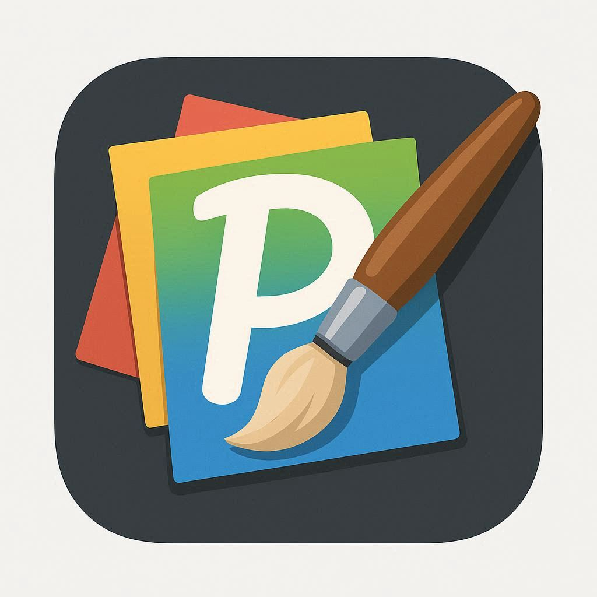

# Pixelium Image Editor



A high-performance cross-platform image editing application built with .NET 9.0 and Avalonia UI.

## Features

### Image Operations
- **Grayscale** - Convert images to grayscale using standard luminosity weights
- **Invert** - Invert image colors
- **Flip** - Horizontal and vertical flipping with parallel processing
- **Gamma Correction** - Adjust image brightness with customizable gamma values
- **Logarithmic Transform** - Apply logarithmic transformation for dynamic range compression

### Filters
- **Box Filter** - Fast averaging blur using mean kernel
- **Gaussian Blur** - Smooth blur with customizable kernel size (3x3, 5x5, 7x7)
- **Sobel Edge Detection** - Detect edges using Sobel operator
- **Laplace Edge Detection** - Detect edges using Laplacian kernel
- **Harris Corner Detection** - Detect corners with adjustable sensitivity and threshold

### Histogram Analysis
- **Histogram Display** - View RGB and luminosity histograms
- **Histogram Equalization** - Enhance image contrast automatically

### Layer System
- **Multiple Layers** - Work with multiple image layers
- **Layer Opacity** - Adjust transparency of individual layers
- **Layer Visibility** - Show/hide layers
- **Layer Locking** - Lock layers to prevent modifications
- **Merge Layers** - Combine layers together
- **Flatten** - Composite all visible layers

### Undo/Redo
- **Command History** - Up to 50 undoable operations
- **Full Support** - All filters and layer operations are undoable

### Performance
- **Lookup Tables (LUT)** - Pre-computed transformations for instant processing
- **Parallel Processing** - Multi-threaded operations for maximum performance
- **Unsafe Pointer Operations** - Direct memory access for speed-critical code

## Keyboard Shortcuts

### File Operations
- `Ctrl+N` - New Project
- `Ctrl+O` - Open Image
- `Ctrl+S` - Save Image
- `Ctrl+Shift+S` - Save As

### Edit Operations
- `Ctrl+Z` - Undo
- `Ctrl+Y` - Redo

### Image Operations
- `Ctrl+G` - Grayscale
- `Ctrl+I` - Invert
- `Ctrl+H` - Flip Horizontal

### View Operations
- `Ctrl+F` - Fit to Screen
- `Ctrl++` - Zoom In (Ctrl + Plus on numpad)
- `Ctrl+-` - Zoom Out (Ctrl + Minus on numpad)
- `Ctrl+0` - Zoom 100% (Ctrl + Zero on top row)

## Usage

### Getting Started

1. **Launch the application**
   ```bash
   dotnet run --project Pixelium.UI/Pixelium.UI.csproj
   ```

2. **Open an image**
   - Click `File > Open` or press `Ctrl+O`
   - Select an image file (PNG, JPEG, BMP)

3. **Apply filters**
   - Use the `Filters` menu to apply various image processing operations
   - Use the `Adjustments` menu for brightness, gamma, and histogram operations

4. **Work with layers**
   - View all layers in the right panel
   - Adjust opacity with the slider
   - Toggle visibility with the eye icon
   - Lock layers to prevent changes

5. **Save your work**
   - Click `File > Save` or press `Ctrl+S`
   - Choose format: PNG, JPEG, or BMP

### Sample Images

The application includes three built-in test images accessible from `File > New Sample Image`:
- **Sample 1: Gradient & Text** - General filter testing
- **Sample 2: Geometric Shapes** - Edge and corner detection testing
- **Sample 3: Color Test Pattern** - Histogram and gamma testing

### Advanced Features

**Harris Corner Detection:**
1. Select `Filters > Harris Corner Detection`
2. Adjust parameters:
   - **Sensitivity (k)**: Controls corner response (0.04-0.06 recommended)
   - **Threshold**: Minimum corner strength (0-255)
   - **Gaussian Sigma**: Pre-processing blur strength
3. Click `Apply` to detect corners

**Histogram Equalization:**
1. Select `Adjustments > Histogram Equalization`
2. The operation automatically enhances contrast
3. View results with `Adjustments > Show Histogram`

## Building from Source

### Prerequisites
- .NET 9.0 SDK
- ImageMagick (for icon generation, optional)

### Quick Build
```bash
# Build all projects
dotnet build Pixelium.sln

# Run the UI application
dotnet run --project Pixelium.UI/Pixelium.UI.csproj
```

### Multi-Platform Distribution

Build for all supported platforms (Linux, Windows, macOS - x64 and ARM64):

```bash
./build-all.sh
```

Builds will be created in the `builds/` directory.

### Supported Platforms
- Linux (x64, ARM64)
- Windows 10/11 (x64, ARM64)
- Windows for Wine (x64, ARM64) - Separate builds optimized for Wine compatibility
- macOS (Intel, Apple Silicon)

## Architecture

### Core Components
- **Pixelium.Core** - Image processing library with no UI dependencies
- **Pixelium.UI** - Avalonia-based desktop application
- **Pixelium.CLI** - Command-line histogram analysis tool (standalone)

### Key Technologies
- **.NET 9.0** - Modern .NET runtime
- **Avalonia UI** - Cross-platform UI framework
- **SkiaSharp** - 2D graphics library
- **MVVM Pattern** - Clean separation of concerns
- **Command Pattern** - Undo/redo implementation
- **Unsafe Code** - Performance-critical operations

### Performance Optimizations
- **LUT Caching** - Lookup tables cached in `ConcurrentDictionary<string, Lazy<byte[]>>`
- **Parallel Processing** - `Parallel.For` for row-based operations
- **Direct Memory Access** - Unsafe pointer operations for pixel manipulation
- **Thread-Safe Design** - Concurrent collections for multi-threaded safety

## File Formats

**Input/Output:**
- PNG (Portable Network Graphics)
- JPEG (Joint Photographic Experts Group)
- BMP (Bitmap)

**Native Format:**
- All operations use `SKColorType.Bgra8888` (4 bytes per pixel)

## License

This project is licensed under the MIT License - see the [LICENSE](LICENSE) file for details.

## Credits

Built with:
- [.NET](https://dotnet.microsoft.com/) - Application framework
- [Avalonia UI](https://avaloniaui.net/) - Cross-platform UI framework
- [SkiaSharp](https://github.com/mono/SkiaSharp) - 2D graphics library
